# 基金宝 (Funder)

一款基于 Android 平台的基金持仓管理与实时估值应用，支持 OCR 截图识别导入、实时估值追踪、财经资讯浏览等功能。采用 Material Design 3 设计语言，支持浅色/暗黑主题切换。

[](https://github.com/wangqm1993/Funder/releases/latest)

<p align="center">
  
  <br/>
  <sub>扫码直接下载 APK 安装包</sub>
</p>

## 功能特性

### 持仓管理
- 实时基金估值，自动定时刷新（可自定义间隔）
- 总资产、今日收益、累计收益一览（金额千位分隔符格式化）
- 左滑删除（含确认弹窗）、右滑编辑持仓，长按拖动排序
- 支持手动搜索添加基金（含搜索引导和空状态提示）

### 净值结算监听
- 后台 WorkManager 定时检测当日净值是否已结算
- 交易日 18:30 起每 30 分钟轮询，非交易日自动跳过
- 结算后推送通知，显示总收益及每只基金明细
- 首页 SummaryCard 实时显示结算状态（"✓ 已结算" / "结算中 3/5"）
- 每张基金卡片显示"已结算"标签
- 设置页可开关结算通知

### OCR 截图导入
- 基于 Google ML Kit 中文文字识别
- 支持相册选择或相机拍照
- 兼容支付宝、天天基金、微信理财通等主流平台截图
- 自动识别基金名称、代码、持仓金额和份额
- 批量导入，支持手动校正

### 基金详情
- 实时估算净值与涨跌幅
- 净值历史走势图（自研折线图组件）
- 持仓股票明细（前十大重仓股）
- 历史净值数据表
- 累计收益率分析
- 基金概况信息

### 财经资讯
- 实时财经新闻列表
- 支持多种布局（大图、三图、右图、纯文本）
- 热门新闻标签
- 下拉刷新，空状态友好提示

### 个性化设置
- 主题模式：浅色模式 / 暗黑模式 / 跟随系统
- 卡片圆角大小动态调节（0~32dp，实时预览）
- 自动刷新间隔设置（预设 + 自定义）
- 净值结算通知开关

### 动画效果
- 开屏动画（缩放渐入 + 光晕旋转）
- 搜索页圆形扩散（Circular Reveal）动画
- 底部导航栏图标弹性缩放动画
- 列表加载骨架屏（Shimmer）动画
- 设置项按压缩放反馈

## 技术架构

### 整体架构
采用 **MVVM + Clean Architecture** 分层架构：

```
app/
├── data/                    # 数据层
│   ├── local/               # 本地数据（Room 数据库）
│   │   ├── FundDatabase.kt
│   │   ├── FundDao.kt
│   │   └── FundHoldingEntity.kt
│   ├── remote/              # 远程数据（API 接口）
│   │   ├── FundApiService.kt
│   │   ├── FundValuationDto.kt
│   │   └── NewsDto.kt
│   └── repository/          # 数据仓库
│       ├── FundRepository.kt
│       └── SettingsRepository.kt
├── di/                      # 依赖注入（Hilt）
│   └── AppModule.kt
├── ocr/                     # OCR 识别
│   └── FundOcrProcessor.kt
├── worker/                  # 后台任务
│   └── NavSettlementWorker.kt
├── ui/                      # 界面层
│   ├── navigation/          # 导航
│   ├── home/                # 首页（持仓）
│   ├── detail/              # 基金详情
│   ├── search/              # 搜索
│   ├── import_fund/         # 截图导入
│   ├── news/                # 资讯
│   ├── stock/               # 股票详情
│   ├── settings/            # 设置
│   ├── splash/              # 开屏
│   ├── components/          # 通用组件
│   └── theme/               # 主题
└── FunderApp.kt             # Application 入口
```

### 技术栈

| 类别 | 技术 | 版本 |
|------|------|------|
| 语言 | Kotlin | 2.1.0 |
| UI 框架 | Jetpack Compose | BOM 2024.12.01 |
| 设计规范 | Material Design 3 | — |
| 依赖注入 | Hilt | 2.53.1 |
| 本地存储 | Room | 2.6.1 |
| 偏好设置 | DataStore Preferences | 1.1.1 |
| 网络请求 | OkHttp | 4.12.0 |
| JSON 解析 | Gson | 2.11.0 |
| 图片加载 | Coil | 2.7.0 |
| 文字识别 | ML Kit (中文) | 16.0.1 |
| 后台任务 | WorkManager | 2.9.1 |
| 导航 | Navigation Compose | 2.8.5 |
| 生命周期 | Lifecycle | 2.8.7 |
| 系统 UI | Accompanist SystemUIController | 0.36.0 |

### 数据流

```
用户操作 → ViewModel → Repository → API / Room Database
                ↓
           StateFlow / Flow
                ↓
         Compose UI 自动重组

后台结算检测：
WorkManager (每30分钟) → NavSettlementWorker
    → FundDao + FundApiService → 检测 navDate == 今天
    → 计算最终收益 → 推送通知
```

## 数据源

| 功能 | 接口来源 | 说明 |
|------|----------|------|
| 实时估值 | 天天基金 | `fundgz.1234567.com.cn` |
| 基金搜索 | 东方财富 | `fundsuggest.eastmoney.com` |
| 基金详情 | 东方财富 | `fund.eastmoney.com/pingzhongdata` |
| 历史净值 | 东方财富 | `fund.eastmoney.com/f10` |
| 财经资讯 | 新浪财经 | `feed.mix.sina.com.cn` |

## 环境要求

- **Android Studio**: Ladybug 或更高版本
- **JDK**: 17
- **Compile SDK**: 35 (Android 15)
- **Min SDK**: 26 (Android 8.0)
- **Target SDK**: 35

## 构建与运行

### 1. 克隆项目

```bash
git clone <repository-url>
cd Funder
```

### 2. 编译运行

使用 Android Studio 打开项目，等待 Gradle 同步完成后，连接 Android 设备或启动模拟器，点击运行。

或使用命令行：

```bash
# 编译 Debug 版本
./gradlew assembleDebug

# 编译并安装到设备
./gradlew installDebug
```

### 3. 生成 Release 版本

```bash
./gradlew assembleRelease
```

> 注意：Release 版本需要配置签名信息。

## 权限说明

| 权限 | 用途 |
|------|------|
| `INTERNET` | 获取基金估值、资讯等网络数据 |
| `CAMERA` | 拍照识别持仓截图（可选） |
| `READ_MEDIA_IMAGES` | 从相册选择持仓截图（Android 13+） |
| `READ_EXTERNAL_STORAGE` | 从相册选择持仓截图（Android 12 及以下） |
| `POST_NOTIFICATIONS` | 净值结算通知推送（Android 13+） |

## 项目亮点

- **全 Compose 实现**：100% 使用 Jetpack Compose 构建 UI，无 XML 布局
- **Material 3 规范**：严格遵循 Google Material Design 3 设计规范，支持动态主题
- **暗黑模式适配**：全局适配暗黑模式，所有页面使用语义化颜色角色（Color Roles）
- **自研图表组件**：基于 Canvas 手绘折线图，支持多线对比、触摸交互、图例显示
- **OCR 智能识别**：支持多平台截图格式，采用表格解析 + 关键词匹配双重策略
- **动态外观配置**：卡片圆角大小支持运行时动态调整，通过 CompositionLocal 全局传递
- **响应式数据流**：基于 Flow + StateFlow 的单向数据流架构，UI 自动响应数据变化
- **骨架屏加载**：首页和资讯页采用 Shimmer 骨架屏动画，提升加载体验
- **净值结算监听**：基于 WorkManager 的后台定时检测，交易日晚间自动检测净值结算并推送最终收益通知
- **无障碍支持**：全局 Icon 和交互元素均配置 contentDescription
- **WebView 错误处理**：股票详情和新闻详情页支持加载失败重试

## 演示

<p align="center">
  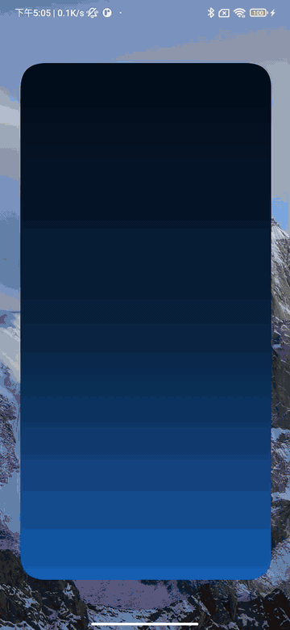
</p>

## 截图预览

| 开屏动画 | 首页 — 持仓总览 | 编辑持仓 |
|:---:|:---:|:---:|
| 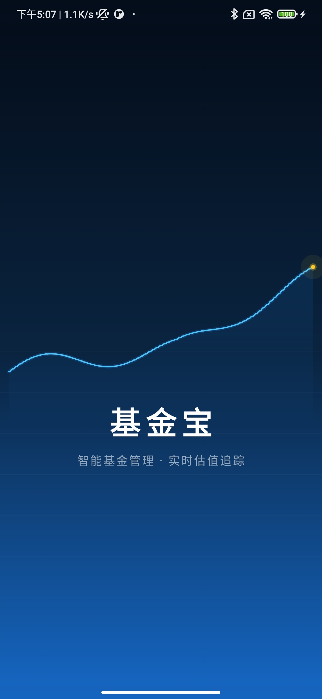 | 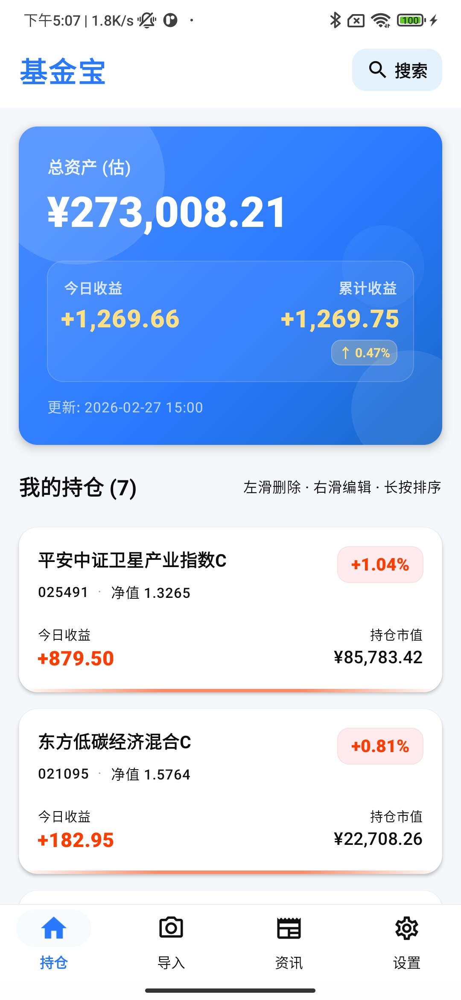 | 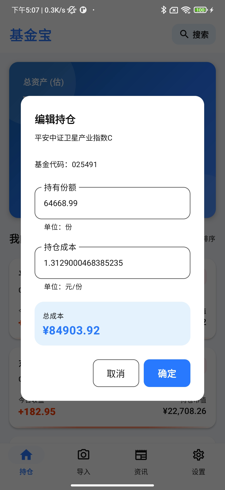 |

| 删除确认 | 基金详情 — 净值估算 | 基金详情 — 持仓明细 |
|:---:|:---:|:---:|
| 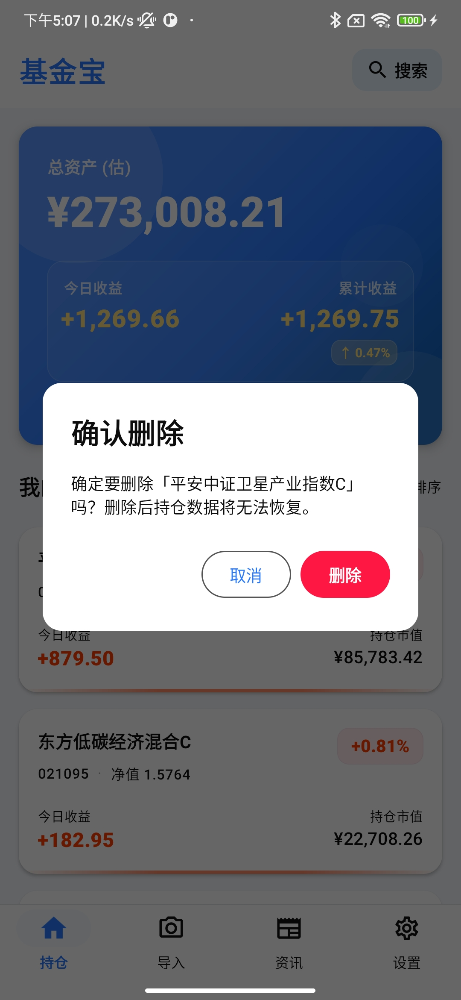 | 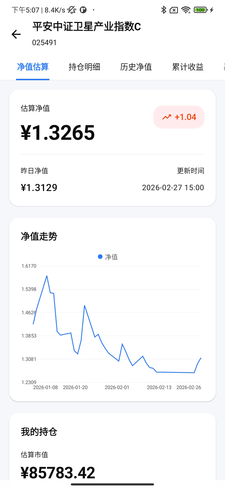 | 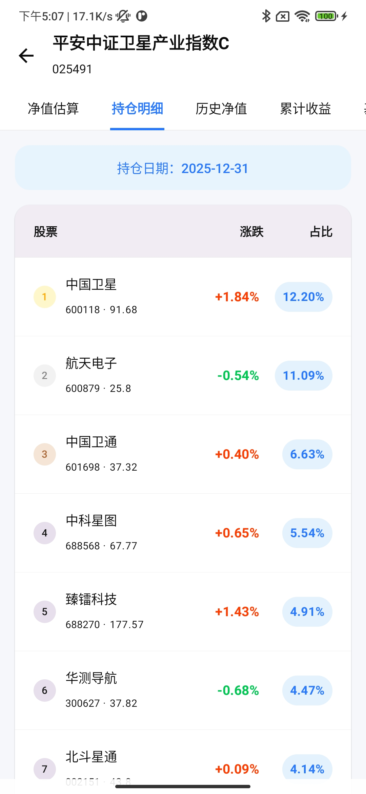 |

| 基金详情 — 历史净值 | 基金详情 — 累计收益 | 基金详情 — 基金概况 |
|:---:|:---:|:---:|
| 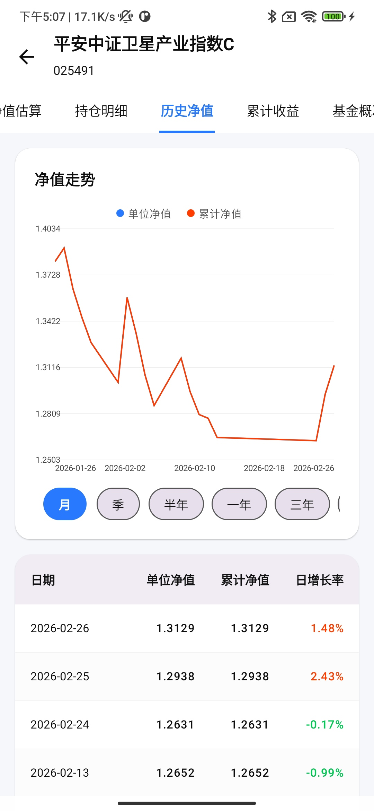 | 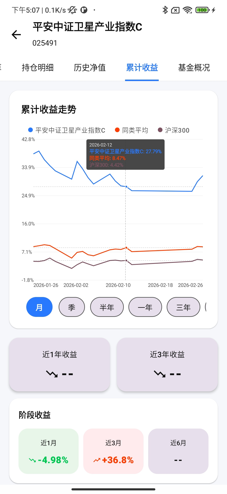 | 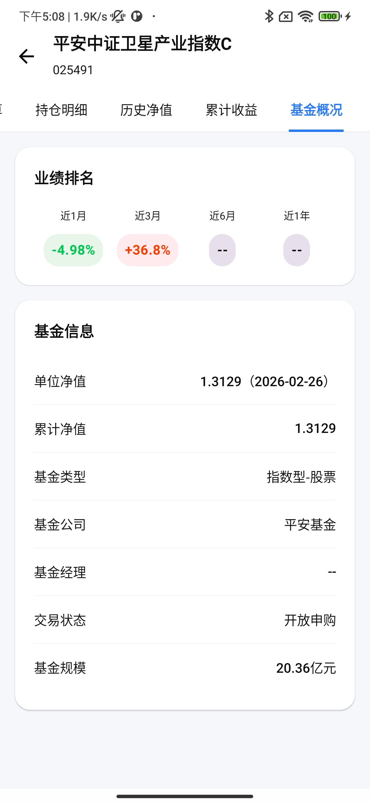 |

| 截图导入 | 财经资讯 | 设置 |
|:---:|:---:|:---:|
| 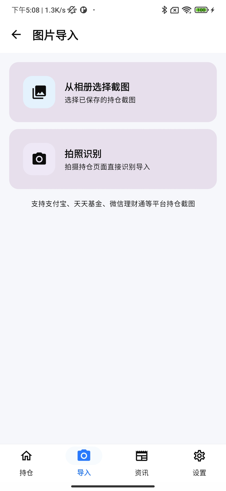 | 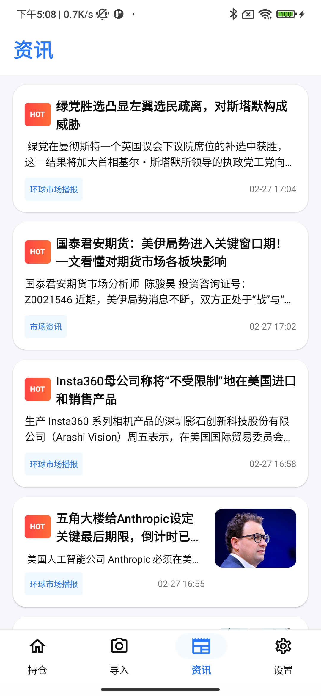 | 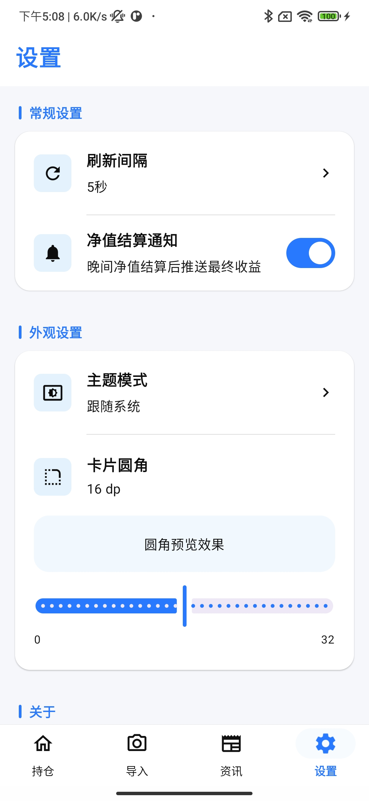 |

## 请作者喝杯咖啡 ☕

> 独立开发不易，从第一行代码到最终上线，无数个深夜与 bug 为伴。
>
> 如果这个项目对你有帮助，或者你觉得它还不错，不妨请作者喝杯咖啡，你的支持是我持续维护的最大动力。
>
> 每一份打赏，都让这个项目离「更好」更近一步。感谢每一位愿意驻足的你 🙏

<p align="center">
  
  &nbsp;&nbsp;&nbsp;&nbsp;
  
</p>

<p align="center">
  <sub>微信支付 &nbsp;&nbsp;&nbsp;&nbsp;&nbsp;&nbsp;&nbsp;&nbsp;&nbsp;&nbsp;&nbsp;&nbsp;&nbsp;&nbsp;&nbsp;&nbsp;&nbsp;&nbsp;&nbsp;&nbsp;&nbsp;&nbsp;&nbsp;&nbsp;&nbsp;&nbsp;&nbsp;&nbsp;&nbsp;&nbsp;&nbsp;&nbsp;&nbsp;&nbsp;&nbsp;&nbsp;&nbsp;&nbsp;&nbsp;&nbsp; 支付宝</sub>
</p>

## License

本项目仅用于个人学习和使用，数据接口来源于公开的第三方服务。
